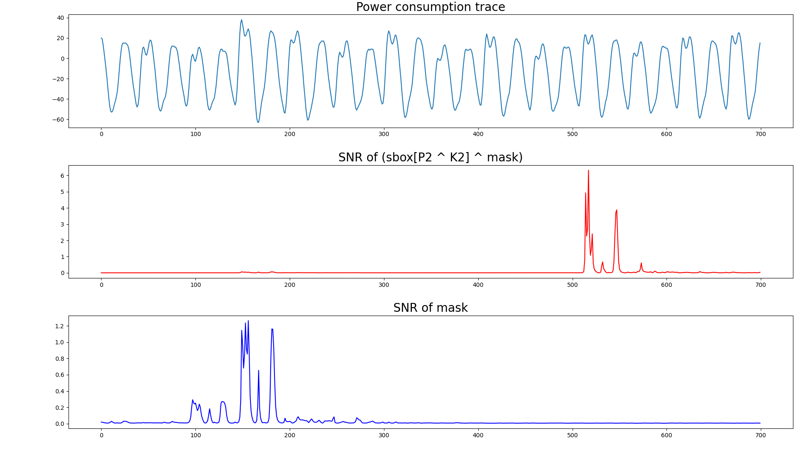

# SCADL

Following the current direction in Deep Learning (DL), more
recent papers have started to pay attention to the efficiency of DL in
breaking cryptographic implementations.

Scadl is a **side-channel attack tool based on deep learning**. It implements most of the state-of-the-art techniques. 

This project has been developed within the research activities of the   Donjon team (Ledger's security team), to help us during side-channel evaluations.
## Features

Scadl implements the following attacks which have been published before:
 - Normal profiling: A straightforward profiling technique as the attacker will use a known-key dataset to train a DL model. Then, this model is used to attack the unknown-key data set. This technique was presented by the following work: [1](https://eprint.iacr.org/2016/921) and [2](https://eprint.iacr.org/2018/053).
 - [Non-profiling](https://tches.iacr.org/index.php/TCHES/article/view/7387) A similar technique to differential power analysis ([DPA](https://paulkocher.com/doc/DifferentialPowerAnalysis.pdf)) but it has the several advantages over DPA to attack protected designs (masking and desynchronization).
 - [Multi-label](https://eprint.iacr.org/2020/436): A technique to attack multiple keys using only one DL model.  
 - [Multi-tasking](https://eprint.iacr.org/2023/006.pdf): Another technique for attacking multiple keys using a single model.
 - Data augmentation: A technique to increase the dataset to boost the DL efficeincy. Scadl includes [mixup](https://eprint.iacr.org/2021/328.pdf) and [random-crop](https://blog.roboflow.com/why-and-how-to-implement-random-crop-data-augmentation/).
 - [Attribution methods](https://eprint.iacr.org/2019/143.pdf): A technique to perform leakage detection using DL.

## Installation
It can be installed using python3

    pip install .

## Requirements
- [keras](https://keras.io/)
- [matplotlib](https://matplotlib.org/)
- [numpy](https://numpy.org/)
- [tensorflow](https://www.tensorflow.org/)
- [h5py](https://pypi.org/project/h5py/)

## Tutorial

### Datasets

Scadl uses two different datasets for its tutorial. The first dataset is collected by running a non-protected AES on [ChipWhisperer-Lite](https://rtfm.newae.com/Targets/CW303%20Arm/). The figure shown below indicates the power consumption of the first round AES (top). The bottom figure shows the SNR of **sbox[P^K]**. The yellow zone indicates P^K and the gray zone is related to **sbox[P^K]** of the 16 bytes. The profiling and non-profiling tutorials use the first peak in the gray zone which is related to **sbox[P[0] ^ K[0]]**. The multi-label tutorial uses the first two peaks of **sbox[P[0] ^ K[0]]** and **sbox[P[1] ^ K[1]]**.


The second dataset is [ASCAD](https://github.com/ANSSI-FR/ASCAD/tree/master/ATMEGA_AES_v1) which is widely used in the side-channel attacks (SCAs) domain. The figure below shows the power consumption trace (top), SNR of **sbox[P[2] ^ K[2]] ^ mask** (middle), and **mask** (bottom).



###  Labeling
we consider for all the experiments, one or several AES Sbox for labeling the DL architectures.
```python 
def  leakage_model(metadata):
"""leakage model for sbox[0]"""
return  sbox[metadata["plaintext"][0] ^ metadata["key"][0]]
```
### DL models
For our experiments, we use CNN and MLP models which are the most used DL models by the SCA community.

