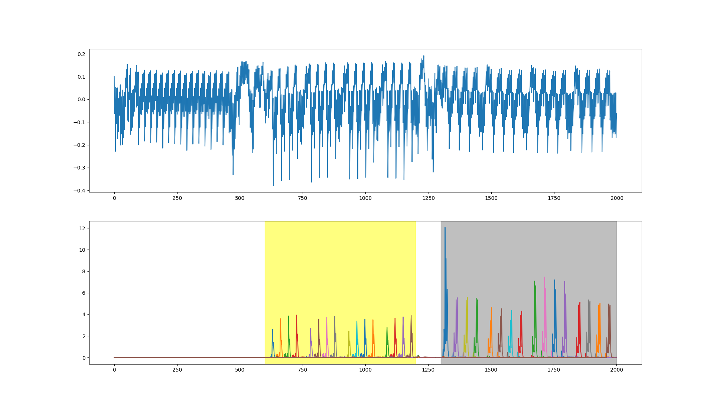

## Tutorial

Scadl uses two different datasets for its tutorial. The first dataset is collected by running a non-protected AES on [ChipWhisperer-Lite](https://rtfm.newae.com/Targets/CW303%20Arm/). The figure shown below indicates the power consumption of the first round AES (top). The bottom figure shows the SNR of SBOX[P^K]. 

